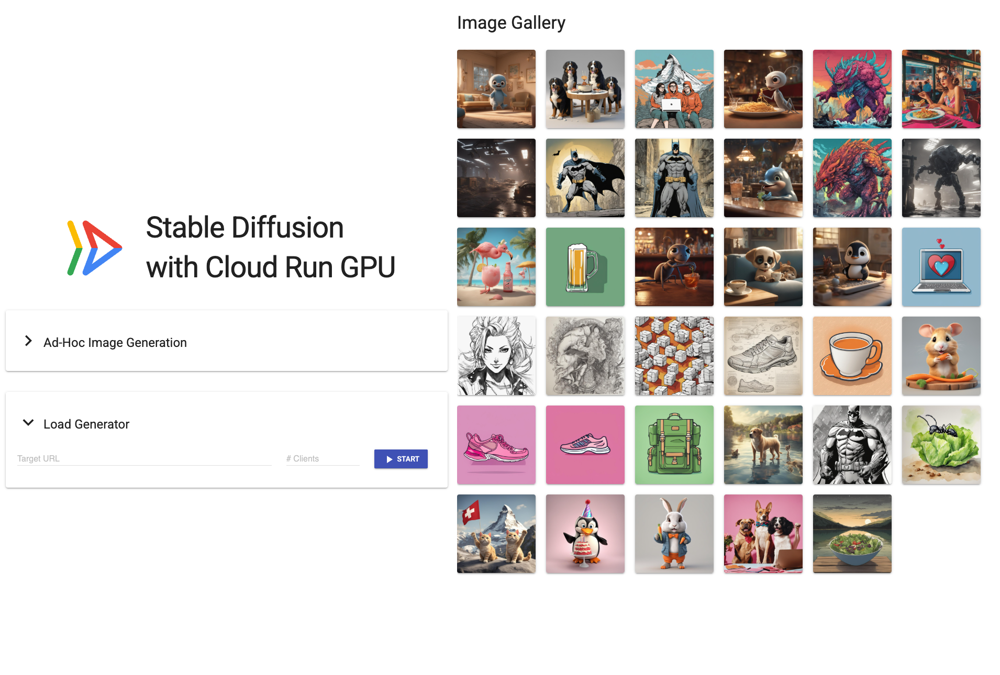

# Cloud Run GPU Demo Stable Diffusion

Runs a Cloud Run Service with GPU with Stable Diffusion.

This is a demo based on the public [Cloud Run Stable Diffusion Codelab](https://codelabs.developers.google.com/codelabs/how-to-use-stable-diffusion-cloud-run-gpu) and adapted with:

- Demo UI
- Much Faster Model (SDXL-turbo)
- Model Cache in GCS
- GCS bucket for generated images

## Infrastructure Setup

Configure your GCP project and region:

```sh
export PROJECT_ID="YOUR PROJECT" 
export REGION="europe-west1" #or any other supported region in https://cloud.google.com/run/docs/configuring/services/gpu#supported-regions
export NETWORK="gpu-demo"
```

Prepare your GCP Project:

```sh
gcloud services enable run.googleapis.com cloudbuild.googleapis.com storage.googleapis.com dns.googleapis.com compute.googleapis.com secretmanager.googleapis.com --project $PROJECT_ID
```

Grant editor role to the default compute service account to allow services like Cloud Build to access project resources.

```sh
PROJECT_NUMBER=$(gcloud projects describe $PROJECT_ID --format="value(projectNumber)")
gcloud projects add-iam-policy-binding $PROJECT_ID \
    --member="serviceAccount:$PROJECT_NUMBER-compute@developer.gserviceaccount.com" \
    --role="roles/editor"
```

Create an artifact repository

```sh
gcloud artifacts repositories create demo \
  --repository-format=docker \
  --location="$REGION" \
  --project="$PROJECT_ID"
```

Create the buckets for storing images and models

```sh
gsutil mb -p $PROJECT_ID -l $REGION gs://$PROJECT_ID-images 
gsutil mb -p $PROJECT_ID -l $REGION gs://$PROJECT_ID-models 
```

Configure VPC with Private Google Access to speed up download from GCS

```sh
gcloud compute networks create $NETWORK --subnet-mode=custom --project=$PROJECT_ID
gcloud compute networks subnets create $NETWORK --range=10.128.0.0/16 --network=$NETWORK --region=$REGION --enable-private-ip-google-access --project=$PROJECT_ID

gcloud dns managed-zones create "google-apis" \
    --dns-name="googleapis.com" \
    --description="Private zone for Google APIs" \
    --visibility=private \
    --networks="$NETWORK" \
    --project=$PROJECT_ID

gcloud dns record-sets transaction start --zone="google-apis" --project=$PROJECT_ID

gcloud dns record-sets transaction add \
    --name="private.googleapis.com." \
    --type=A \
    --ttl=300 \
    --zone="google-apis" \
    --project=$PROJECT_ID \
    199.36.153.8 199.36.153.9 199.36.153.10 199.36.153.11

gcloud dns record-sets transaction add \
    --name="*.googleapis.com." \
    --type=CNAME \
    --ttl=300 \
    --zone="google-apis" \
    --project=$PROJECT_ID \
    "private.googleapis.com."

gcloud dns record-sets transaction execute --zone="google-apis" --project=$PROJECT_ID
```

Set up Nat

```sh
gcloud compute routers create nat-router --network $NETWORK --region $REGION --project $PROJECT_ID
gcloud compute routers nats create nat --router=nat-router --region=$REGION --auto-allocate-nat-external-ips --nat-all-subnet-ip-ranges  --project $PROJECT_ID
```

## Container Images

## Build from source

```sh
# Inference Service
(cd stable-diffusion-fastapi && gcloud builds submit --tag "$REGION-docker.pkg.dev/$PROJECT_ID/demo/torchserve-sdxl-turbo" --project $PROJECT_ID)
# UI Sevice
(cd demo-ui && gcloud builds submit --tag "$REGION-docker.pkg.dev/$PROJECT_ID/demo/demo-ui" --project $PROJECT_ID)
```

## Download the model to GCS

The following Cloud Build job can be used to download the required model assets and push to GCS:

```sh
gcloud builds submit --config cloudbuild-modeldownload.yaml --substitutions="_BUCKET_NAME=$PROJECT_ID-models" --project $PROJECT_ID
```

## Deploy the Cloud Run Service

```sh
sed -e "s/PROJECT_ID/${PROJECT_ID}/g" -e "s/REGION/${REGION}/g" -e "s/NETWORK/${NETWORK}/g" -e "s/SUBNET/${NETWORK}/g" stable-diffusion-service.template.yaml > stable-diffusion-service.yaml
gcloud run services replace stable-diffusion-service.yaml --project $PROJECT_ID
```

## Test it

### UI With Cloud Run Proxy

Use this command to get a local authentication proxy to access your demo:

```sh
gcloud run services proxy stable-diffusion-gpu --region $REGION --port=8081 --project=$PROJECT_ID 
```

### UI with IAP

Create an IAP for your demo:

```sh
PROJECT_NUMBER="$(gcloud projects describe $PROJECT_ID --format='value(projectNumber)')"
gcloud run services add-iam-policy-binding stable-diffusion-gpu \
--region=$REGION \
--member="serviceAccount:service-$PROJECT_NUMBER@gcp-sa-iap.iam.gserviceaccount.com" \
--role='roles/run.invoker' \
--project=$PROJECT_ID
```

